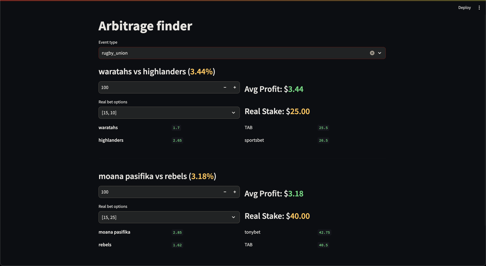

#Tool to find arbitrage oportunities.

link to quick demo: [youtube](https://youtu.be/RiVDHTbusGI)

Pupeteer is used to scrape sites and save data to a json file. Python is used to run the JS scripts and then read the
Json files and do the abitrage finding calculations. Streamlit is then used for a simple ui.

Ive tried selenium for python befor and wasnt too impressed. Pupeteer realy feels like the right tool to me. I really like
Python for working with data and the ui is not important so Python feels like a good choice for the bulk of the work.
